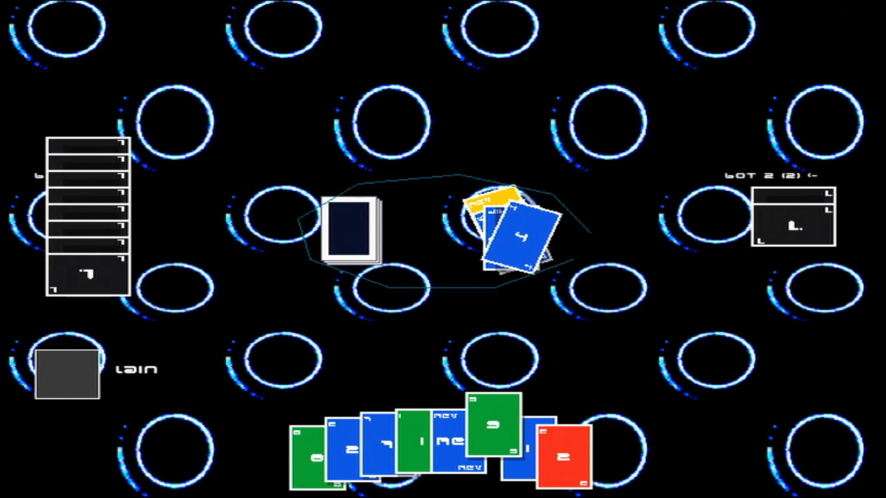

# Eins!
Finally, (an) Uno (style game) for the oldest Xbox known to man.

<i>
An example of a 4-player solo match against bots.
</i>

# Installation
- Download the latest release .zip
- Extract it and copy the contents to your Xbox's preferred homebrew folder
- Launch the game on your Xbox, and you're set! Select "Solo Session" for a quick match against up to 3 bots, or host/join a LAN game! (XLink Kai recommended)

# Roadmap
- [ ] Fix giant laundry list of menu issues (local multiplayer menu is completely broken, the rest of the menus also need polish)
- [ ] Fix bluff and Eins! ("Uno") functions
- [ ] Write MP3 playing logic instead of using WAV/OGGs to conserve space (current build is ~300MB once compiled, yikes!)
- [ ] Add taunts once multiplayer is further along (accessed via right analog stick up/down/left/right)
- [ ] Add male/female voices for card callouts
- [ ] Add avatar selection, username input, and voice style selection to profile.cfg
- [ ] Add subtitles for card callouts to improve accessibility
- [ ] Add glowing border around the avatar of the player making their turn for increased readability
- [ ] Fix broken menu/match music
- [ ] Add non-standard Uno-style rules, player / round time limits and time counters
- [ ] PSP, Windows + Linux builds (+ cross-play) (?)
- [ ] Add ability to fetch user avatars from xb.live gamertags(?), or set up an offline avatar system.
- [ ] Modify renderer code to support 640x480 and 1280x720 instead of just 640x480 (not sure if it's possible in NXDK without a seperate executable)
- [ ] Implement simple keyboard chat(?)
- [ ] Xbox Video Camera support(?) - unlikely, but would be fun!
- [ ] Figure out hardware acceleration issues
- [ ] Actually settle on an aesthetic that's not just a hodgepodge of assets and shapes (getting closer, thinking of settling on a pastel vaporwave/futuristic theme).

Any and all code contributions to the project are greatly appreciated!
